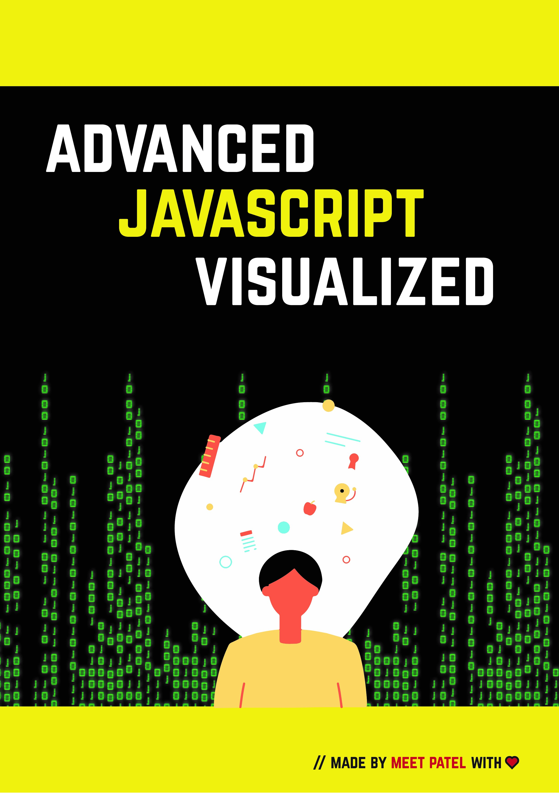

<h4 align="center"> <u>Advanced JavaScript Visualized</u> </h4>

    - This repo contains code examples of this book, all code explanations with visualization available on this book.

 

    Take a sneak pick to get an idea regarding book.

[Youtube - Advanced JavaScript Visualized😁](https://www.youtube.com/watch?v=SAPoWxt2ddQ&ab_channel=overflow-hidden) 
 

    

 

<h4 align="left"> Links to purchase book </h4>

| Platform                     | 🔑                                                     |
| ----------------             | :----------------------------------------------------- |
| Amazon  Internation          | [Link](https://www.amazon.com/dp/B08SNXC66S)                           |
| Amazon India                 | [Link](https://www.amazon.in/dp/B08SNXC66S/) |
| Gumroad                      | [Link](https://gumroad.com/l/zhkzz) |

 

<h4 align="left"> Author </h4>
    <li>
        <a href="https://meetmywords.ml" target="_blank">Meet Patel</a>
    </li>

 
<h4 align="left"> Book Cover Artist </h4>
    <li>
        <a href="https://mitdasondi.ml" target="_blank">Mit Dasondi</a>
    </li>
